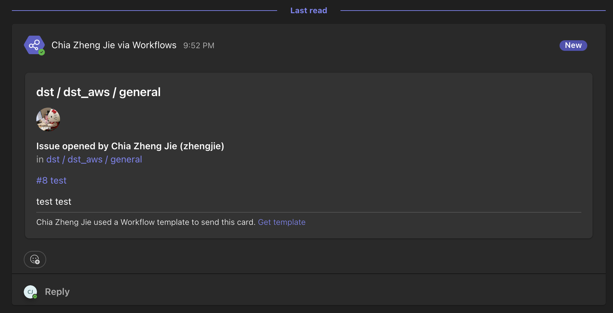

# msteams-gitlab-webhook-message

Since the gitlab webhook is deprecating, the MSTeams-Gitlab integration has stopped working. This is a workaround utilizing the "Post to a channel when a webhook request is received" template in MSTeams workflow template.

## Setup

### MS Teams

1. Create a new workflow using the "Post to a channel when a webhook request is received" template.
2. Select your teams and channels you wish to post to.
3. Click "create" and wait for a webhook url to be generated by MSTeams.
4. Edit the workflow, remove the default "send each adaptive card" step.
5. Add a new step "Post card in chat or channel".
6. Configure as follows:
    - Post as: `Flow Bot`
    - Post in: `Channel`
    - Team: `<your chosen team>`
    - Channel: `<your chosen channel>`
    - Adaptive Card: `<paste the content in gitlab-adaptive-card.json in this repo>`

### Gitlab

1. Go to your desired project or group to monitor.
2. Go to "Settings" -> "Integrations"
3. Select "Microsoft Teams Notifications"
4. Paste the webhook url.
5. Select the triggers accordingly.
6. Save changes.